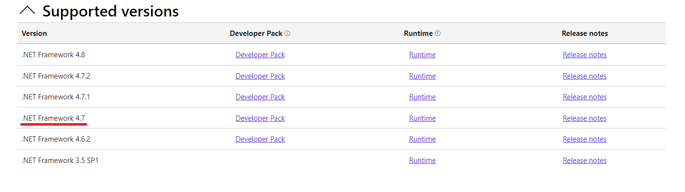
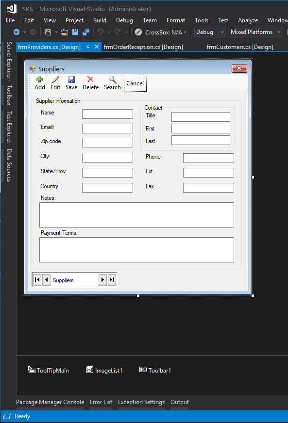

# Salmon King Seafood Reference App (SKS) WinForms C#


# About the App
Salmon King Seafood (SKS) is a reference App create to show some of the migration capabilities of the [Visual Basic Upgrade Companion](https://www.mobilize.net/visual-basic-upgrade-companion) [VBUC](https://www.mobilize.net/visual-basic-upgrade-companion) from [Mobilize.Net](https://www.mobilize.net)

This repo contanins the migrated [SKS VB6 Version](https://github.com/MobilizeNet/SKSVB6)

# Building the App

You should need to download the .Net Framework 4.7 here https://dotnet.microsoft.com/en-us/download/visual-studio-sdks?cid=getdotnetsdk



You can clone the repository to your machine. From the command line just run:
```
git clone https://github.com/MobilizeNet/SKSWinForms.git
```

Or you can download the code by clicking on Download ZIP

> NOTE: if you download the code remember to unblock your files. When you download certain files Windows will block then for 
> security and you might get an error like 

> To fix this problem:
> Open the file explorer. Navigate to project/solution directory
> Search for *.resx. --> You will get list of resx files
> Right click the resx file, open the properties and check the option 'Unblock'
> Repeat #3 for each resx file.
> Reload the project.

Once you have downloaded the code look for SKS.sln. And open that file.
When the solution is open the first thing you need to do is restore packages.
One easy way to do is right click on your solution node. 

Select the `Manage Nuget Packages for Solution...` and select that option. From there you can make sure that all nugets are restored.

Once all the nugets have been restore, just rebuild and run. 

# Migrated Screens

Below you can see some of the migrated screens


[VB Screen](https://github.com/MobilizeNet/SKSVB6/raw/master/Media/SKSPhotos/frmOrderReception.PNG)



[VB Screen](https://github.com/MobilizeNet/SKSVB6/raw/master/Media/SKSPhotos/frmProviders.PNG)


[VB Screen](https://github.com/MobilizeNet/SKSVB6/raw/master/Media/SKSPhotos/frmCustomers.PNG)


[VB Screen](https://github.com/MobilizeNet/SKSVB6/raw/master/Media/SKSPhotos/frmAddProductTo.PNG)


[VB Screen](https://github.com/MobilizeNet/SKSVB6/raw/master/Media/SKSPhotos/frmAddStockManual.PNG)


[VB Screen](https://github.com/MobilizeNet/SKSVB6/raw/master/Media/SKSPhotos/frmReceptionApproval.PNG)


[VB Screen](https://github.com/MobilizeNet/SKSVB6/raw/master/Media/SKSPhotos/frmRequestApproval.PNG)


[VB Screen](https://github.com/MobilizeNet/SKSVB6/raw/master/Media/SKSPhotos/frmSearch.PNG)

# Some VBUC Features used by this migration

## ADODB to `System.Data.Common`

Converts `ADODB` to ADO.Net by using the System.Data.Common libraries and some helpers.  

> **Remarks**
>- This option converts `ADODB` to ADO.NET by using helper classes but with a very high automation level.
>-	If the VB6 code is using data binding to grids it is also recommended to convert all data grids to .Net components.

### General Description:

This solution uses a set of helper objects to provide equivalent behavior in .Net and to encapsulate the ADO.Net machinery required in order to handle a set of data, more specifically for the RecordSet object, which is very powerful and flexible in VB6 and does not have a direct equivalence in .Net. The approach reduces the manual changes effort to achieve functional equivalence.

The usage of `System.Data.Common` libraries provides the application with the ability to interact with different Database Manager Systems (e.g. SQL Server, Oracle, MS Access, etc) through its ADO.Net 2.0 compliant providers with just a minimal configuration effort and proper dialect changes.

**Deployment Note**

This feature if needed can be configured using a .Net configuration file containing specific sections. See [Example](https://gist.github.com/orellabac/a644a07dc02094698730f6619d1ba071)

|  Class	|   Maps To |
| ---       | ---       |
|ADODB.RecordSet	|UpgradeHelpers.DB.ADO.ADORecordSetHelper|
|ADODB.Command	|System.Data.Common.DbCommand|
|ADODB.CommandTypeEnum	|System.Data.CommandType|
|ADODB.Connection	|System.Data.Common.DbConnection
|ADODB.DataTypeEnum	|System.Data.DbType
|ADODB.Field	|System.Data.DataColumn
|ADODB.Fields	|System.Data.DataColumnCollection
|ADODB.IsolationLevelEnum	|System.Data.IsolationLevel
|ADODB.ObjectStateEnum	|System.Data.ConnectionState
|ADODB.Parameter	|System.Data.Common.DbParameter
|ADODB.ParameterDirectionEnum	|System.Data.ParameterDirection
|ADODB.Parameters	|System.Data.Common.DbParameterCollection
|ADODB.Stream	|System.IO.StreamWriter
|ADODB.LockTypeEnum	|UpgradeHelpers.DB.ADO.LockTypeEnum
|ADODB.CursorLocationEnum	|UpgradeHelpers.DB.ADO.CursorLocationEnum
|ADODB.AffectEnum	|UpgradeHelpers.DB.ADO.AffectEnum
|ADODB.EventStatusEnum	|UpgradeHelpers.DB.ADO.Events.EventStatusEnum
|ADODB.EventReasonEnum	|UpgradeHelpers.DB.ADO.Events.EventReasonEnum
|ADODB.PositionEnum	|UpgradeHelpers.DB.ADO.PositionEnum
|MSAdodcLib.Adodc	|UpgradeHelpers.DB.ADO.ADODataControlHelper
|MSAdodcLib.EOFActionEnum	|UpgradeHelpers.DB.Controls.EOFActionEnum
|MSAdodcLib.BOFActionEnum	|UpgradeHelpers.DB.Controls.BOFActionEnum

### Code Examples

**VB6**
```vb
Dim conConnection As New ADODB.Connection
Dim cmdCommand As New ADODB.Command
Dim rstRecordSet As New ADODB.Recordset
conConnection.Open
cmdCommand.CommandText = "SELECT * FROM TestTable;"
...
rstRecordSet.Open
If rstRecordSet.EOF = False Then
      MsgBox rstRecordSet.Fields(0).Name & "=" & rstRecordSet.Fields(0)
Else
    MsgBox "No records were returned using the query " & cmdCommand.CommandText
End If

```

**C#**
```csharp
using UpgradeHelpers.DB;
...
DbConnection conConnection = AdoFactoryManager.GetFactory().CreateConnection();
DbCommand cmdCommand = AdoFactoryManager.GetFactory().CreateCommand();
ADORecordSetHelper rstRecordSet = new ADORecordSetHelper("");
conConnection.Open();
...
cmdCommand.CommandText = "SELECT * FROM TestTable;";
...
rstRecordSet.Open();
if (! rstRecordSet.EOF)
{
    MessageBox.Show(Convert.ToString(rstRecordSet[0]), Application.ProductName);
}
else
{
    MessageBox.Show("No records were returned using the query " + cmdCommand.CommandText, Application.ProductName);
}
```

## `MSFlexGridLib` To DataGridViewFlex

Maps Microsoft's `MSFlexGridLib` to a helper class that extends the `System.Windows.Forms.DataGridView` component

| Class	|Maps To|
| -- | --|
|MSFlexGridLib.MSFlexGrid	|UpgradeHelpers.Gui.DataGridViewFlex|

**VB6**
```vb
Private Sub Form_Load()
    Dim ctl As MSFlexGrid
    Set ctl = MSFlexGrid1
    ctl.ScrollBars = flexScrollBarBoth
    ctl.GridLines = flexGridNone
End Sub
```

```csharp
private void Form1_Load(Object eventSender, EventArgs eventArgs)
{
	UpgradeHelpers.Gui.DataGridViewFlex ctl;
    ctl = new UpgradeHelpers.Gui.DataGridViewFlex();
	ctl.ScrollBars = ScrollBars.Both;
	ctl.CellBorderStyle = DataGridViewCellBorderStyle.None;
}
```

## `VBCollection` To `OrderedDictionary`

Convert Collection type to `System.Collections.Specialized.OrderedDictionary`


|Class	|Maps To
| -- | --|
|vba.Collection	| System.Collections.Specialized.OrderedDictionary|

## `MSComctLib` To `System.Windows.Forms`


Converts Microsoft's `MSComctLib` classes to `System.Windows.Forms`. 

>Remarks:
>-	By using this option the converted application will not have any >reference to the COM Component.


|Class	|Maps To|
|--|--|
|MSComctlLib StatusBar	|System.Windows.Forms.StatusStrip
|MSComctlLibToolbar	|System.Windows.Forms.ToolStrip
|MSComctlLibImageList	|System.Windows.Forms.ImageList
|MSComctlLibTabStrip	|System.Windows.Forms.TabControl
|MSComctlLibTreeView	|System.Windows.Forms.TreeView
|MSComctlLibImageCombo	|System.Windows.Forms.ComboBox
|MSComctlLibListView	|System.Windows.Forms.ListView
|MSComctLib.ProgressBar	|System.Windows.Forms.ProgressBar

**VB6**
```vb
Begin VB.Form Form1 
...
   Begin MSComctlLib.ImageCombo ImageCombo1 
      ...
   End
   Begin MSComctlLib.Slider Slider1 
      ...
   End
   Begin MSComctlLib.ImageList ImageList1 
      ...
   End
   Begin MSComctlLib.ListView ListView1 
      ...
   End
   Begin MSComctlLib.TreeView TreeView1 
      ...
   End
   Begin MSComctlLib.ProgressBar ProgressBar1 
      ...
   End
   Begin MSComctlLib.StatusBar StatusBar1 
      ...
   End
   Begin MSComctlLib.TabStrip TabStrip1 
      ...
   End
   Begin MSComctlLib.Toolbar Toolbar1 
      ...
   End
...
```

**C#**
```csharp
partial class Form1
{
   ...
   public  System.Windows.Forms.MaskedTextBox MaskEdBox1;
   public  System.Windows.Forms.ComboBox ImageCombo1;
   public  System.Windows.Forms.TrackBar Slider1;
   public  System.Windows.Forms.ImageList ImageList1;
   public  System.Windows.Forms.ListView ListView1;
   public  System.Windows.Forms.TreeView TreeView1;
   public  System.Windows.Forms.ProgressBar ProgressBar1;
   private  System.Windows.Forms.ToolStripStatusLabel _StatusBar1_Panel1;
   public  System.Windows.Forms.StatusStrip StatusBar1;
   private  System.Windows.Forms.TabPage _TabStrip1_Tab1;
   public  System.Windows.Forms.TabControl.TabPageCollection TabStrip1_Tabs;
   public  System.Windows.Forms.TabControl TabStrip1;
   public  System.Windows.Forms.ToolStrip Toolbar1;
   ...
   private void  InitializeComponent()
   {
      ...
      this.ImageCombo1 = new System.Windows.Forms.ComboBox();
      this.Slider1 = new System.Windows.Forms.TrackBar();
      this.ImageList1 = new System.Windows.Forms.ImageList();
      this.ListView1 = new System.Windows.Forms.ListView();
      this.TreeView1 = new System.Windows.Forms.TreeView();
      this.ProgressBar1 = new System.Windows.Forms.ProgressBar();
      this.StatusBar1 = new System.Windows.Forms.StatusStrip();
      this._StatusBar1_Panel1 = new System.Windows.Forms.ToolStripStatusLabel();
      this.TabStrip1 = new System.Windows.Forms.TabControl();
      this.TabStrip1_Tabs = new System.Windows.Forms.TabControl.TabPageCollection(TabStrip1);
      this._TabStrip1_Tab1 = new System.Windows.Forms.TabPage();
      this.Toolbar1 = new System.Windows.Forms.ToolStrip();
  }
```